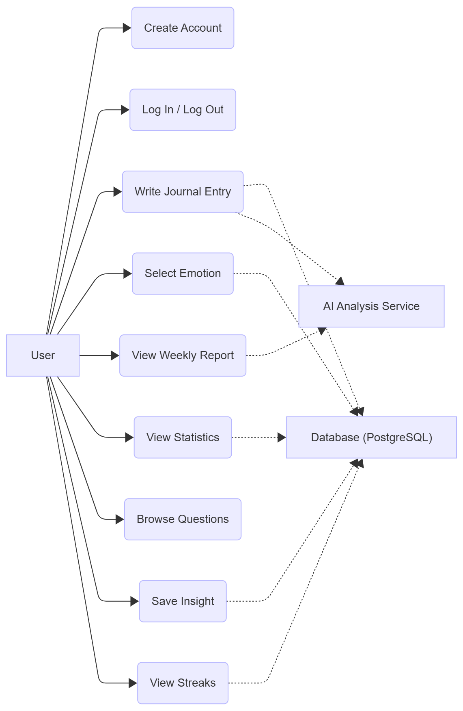

# Features & Requirements

## Epics Overview

| Epic | Description | Stories | Status |
|------|-------------|---------|--------|
| E1: Account Management | User registration, authentication, and account lifecycle | 4 | ✅ |
| E2: Emotion Journal | Daily journaling with emotion tracking and AI analysis | 4 | ✅ |
| E3: Educational Section | Emotion wheel and emotional literacy resources | 1 | ✅ |
| E4: Statistics Dashboard | Visual analytics and emotion trend analysis | 3 | ✅ |
| E5: Weekly AI Reports | Automated AI-driven emotional pattern analysis | 2 | ✅ |
| E6: Gamification ("Spark") | Daily streak tracking to encourage consistent journaling | 1 | ✅ |
| E7: Insights Collection | Personal library for saving meaningful AI-generated insights | 1 | ✅ |
| E8: Question of the Day | Reflective prompts to inspire journal entries | 1 | ✅ |

## User Stories

### Epic 1: Account Management

User authentication and profile management to ensure secure, personalized access.

| ID | User Story | Acceptance Criteria | Priority | Status |
|----|------------|---------------------|----------|--------|
| US-1.1 | As a new user, I want to create an account with email and password, so that I can securely store my personal data | - User can successfully create an account - User cannot register with existing email - Email format and password length (≥8 chars) validated - Password stored as hash | Must | ✅ |
| US-1.2 | As a registered user, I want to log in with my credentials, so that I can access my private data | - User can successfully log in - Valid credentials return JWT token - Invalid credentials return 401 error - Protected routes accessible only with token | Must | ✅ |
| US-1.3 | As a logged-in user, I want to log out, so that my session ends securely | - JWT token cleared from localStorage - User redirected to login page - Protected routes inaccessible after logout | Should | ✅ |
| US-1.4 | As a registered user, I want to reset my password if I forget it, so that I can regain access to my account | - User can request password reset - Reset link sent to email - User can set new password with valid token - No sensitive data leaked in response | Could | ✅ |

### Epic 2: Emotion Journal

Core journaling functionality with emotion tracking and AI-powered analysis.

| ID | User Story | Acceptance Criteria | Priority | Status |
|----|------------|---------------------|----------|--------|
| US-2.1 | As a user, I want to write a daily note and select my mood, so that I can track how I feel and what influences my emotions | - Entry saves successfully to database - Each user sees only their own entries - Text and emotion are required fields - Confirmation message displayed after saving | Must | ✅ |
| US-2.2 | As a user, I want to see my previous entries, so that I can reflect on my emotions over time | - Entries retrieved from database - Sorted by date (latest first) - Each entry shows date, emotion(s), and text - Only logged-in user's data displayed | Must | ✅ |
| US-2.3 | As a user, I want to edit or delete my past entries, so that I can correct mistakes or remove unwanted content | - User can edit/delete only their own entries - UI updates immediately after changes - Confirmation modal shown before deletion - Deleted entries removed from database | Should | ✅ |
| US-2.4 | As a user, I want the AI to analyze my text and detect underlying emotions, so that I can better understand what I feel | - API returns valid emotion labels - Analysis result displayed clearly in UI - System handles network/API errors gracefully - Detected emotions compared with user-selected emotions | Should | ✅ |

### Epic 3: Educational Section

Emotional literacy resources to help users understand and articulate emotions.

| ID | User Story | Acceptance Criteria | Priority | Status |
|----|------------|---------------------|----------|--------|
| US-3.1 | As a user, I want to see a visual "Emotion Wheel" of primary emotions, so that I can explore and understand different feelings | - Wheel displays all primary emotion categories - Clicking category reveals related emotions - Clicking emotion shows description - Data loaded from /api/emotions endpoint | Should | ✅ |

### Epic 4: Statistics Dashboard

Visual analytics to help users identify emotional patterns and trends.

| ID | User Story | Acceptance Criteria | Priority | Status |
|----|------------|---------------------|----------|--------|
| US-4.1 | As a user, I want to see a chart of my recorded emotions, so that I can understand how often I feel different emotions over time | - Chart displays correct emotion distribution - Data accurate for logged-in user - Visual representation (bar/pie chart) clear and readable | Must | ✅ |
| US-4.2 | As a user, I want to see my predominant emotion for a selected period, so that I can identify my mood trends | - Correct emotion highlighted for selected period - Updates automatically when date filter changes - Predominant emotion determined by highest count | Should | ✅ |
| US-4.3 | As a user, I want to filter my statistics by day, week, or month, so that I can analyze short-term or long-term patterns | - Charts update correctly based on filter - Predominant emotion recalculates for period - Works without page reload - Supports day, week, and month periods | Should | ✅ |

### Epic 5: Weekly AI Reports

Automated AI-driven analysis to reveal emotional patterns, triggers, and recommendations.

| ID | User Story | Acceptance Criteria | Priority | Status |
|----|------------|---------------------|----------|--------|
| US-5.1 | As a user, I want the system to generate a weekly report analyzing my emotional patterns, so that I can understand triggers, trends, and mood fluctuations | - Report generates based on week's entries - Contains detected triggers and patterns - Provides personalized recommendations - Report data matches actual entries - Displayed clearly in frontend UI | Should | ✅ |
| US-5.2 | As a user, I want to access past weekly reports, so that I can track my emotional trends over time | - User can see all past reports for their account - Reports listed chronologically - Selecting a report displays full content - Only logged-in user's reports visible - Can delete old reports | Should | ✅ |

### Epic 6: "Spark" Gamification

Streak tracking to motivate consistent journaling habits.

| ID | User Story | Acceptance Criteria | Priority | Status |
|----|------------|---------------------|----------|--------|
| US-6.1 | As a user, I want to see my journaling streak displayed as a "spark" icon, so that I stay motivated to write every day | - Streak increases by 1 for consecutive days - Streak resets if no entry for 24+ hours - Spark icon updates based on streak value - Data persists between sessions - Displays current streak count - Shows longest streak achieved | Could | ✅ |

### Epic 7: Insights Collection

Personal library for saving meaningful AI-generated observations.

| ID | User Story | Acceptance Criteria | Priority | Status |
|----|------------|---------------------|----------|--------|
| US-7.1 | As a user, I want to save key insights from AI reports, so that I can return to them later for reflection | - Users can save any AI insight with one click - Insights display correctly in personal list - Can edit insight text - Deleted insights no longer appear in UI - Insights stored with date | Could | ✅ |

### Epic 8: Question of the Day

Reflective prompts to inspire journal entries.

| ID | User Story | Acceptance Criteria | Priority | Status |
|----|------------|---------------------|----------|--------|
| US-8.1 | As a user, I want to browse a list of reflective questions, so that I can choose one that resonates with me and use it for journaling | - Questions load from database - Users can scroll and view all questions - Selected question appears in journal input - Static list of 20-30 questions for MVP | Could | ✅ |

## Use Case Diagram

## Non-Functional Requirements

### Performance

| Requirement | Target | Measurement Method |
|-------------|--------|-------------------|
| Page load time | < 2 seconds | Lighthouse / manual testing |
| API response time | < 2 seconds | Backend logging / load testing |
| Concurrent users | 10+ users | Local stress testing |
| Database query time | < 500ms | PostgreSQL query analyzer |

### Security

- **Authentication**: JWT-based authentication with bcrypt password hashing
- **Authorization**: Role-based access control - users can only access their own data
- **Data Encryption**: HTTPS for all API communication with external AI service
- **Input Validation**: Server-side validation for all user inputs to prevent injection attacks
- **Password Policy**: Minimum 8 characters required

### Accessibility

- **WCAG Compliance**: WCAG 2.1 Level AA standards
- **Specific Features**:
  - Readable typography with sufficient contrast ratios
  - Keyboard navigation support for all interactive elements
  - Clear focus indicators
  - Semantic HTML structure
  - Alt text for visual elements

### Reliability

| Metric | Target |
|--------|--------|
| Uptime | 99% |
| Recovery time | < 5 minutes |
| Data backup | Daily automated backups |
| Error handling | Graceful degradation with user-friendly error messages |

### Compatibility

| Platform/Browser | Minimum Version |
|------------------|-----------------|
| Chrome | 90+ |
| Firefox | 88+ |
| Safari | 14+ |
| Edge | 90+ |
| Mobile (iOS) | iOS 14+ |
| Mobile (Android) | Android 10+ |

*The minimum supported browser versions are determined based on support for modern web standards (ES6+, Fetch API, CSS Grid/Flexbox) used in the application, according to data from caniuse.com and official browser documentation.