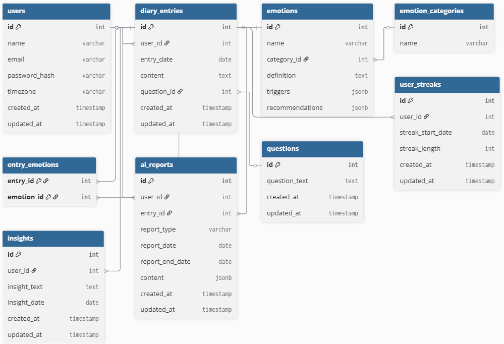

# Criterion: Database

## Architecture Decision Record

### Status

**Status:** Accepted  

**Date:** 2026-01-04

### Context

The system must support:

- Structured diary entries  
- A complex, hierarchical emotion taxonomy  
- AI-generated semi-structured reports with different structure for daily and weekly types  
- User engagement metrics such as streaks  
- Automatic timestamp management and strong referential integrity 
- Role-based access control and masking of sensitive user data 

### Decision

PostgreSQL was selected as the primary relational database management system (RDBMS) for the application.

### Alternatives Considered

| Alternative | Pros | Cons | Why Not Chosen |
|-------------|------|------|----------------|
| MongoDB | Flexible schema, easy storage of deep JSON | Weak relational integrity, complex joins in app layer | The domain is highly relational |

### Consequences

**Positive:**
- Strong relational integrity between users, entries, and emotions  
- High-performance analytical queries via SQL views  
- JSONB enables future AI output changes without schema migrations  

**Negative:**
- Schema changes require migration scripts  
- Requires connection pooling as the user base scales  

**Neutral:**
- Increased upfront schema design effort compared to NoSQL solutions  

## Implementation Details

### Project Structure

```
db/
└── migrations/
    ├── 02_create_tables.sql                # Base schema 
    ├── 03_insert_seed_data.sql             # Emotions, categories, questions
    ├── 04_create_indexes.sql               # Performance optimization
    ├── 05_create_roles_and_privileges.sql  # Role-based access control
    ├── 06_create_views.sql                 # Analytics and PII masking
    ├── 07_create_triggers.sql              # Automated timestamp updates
    └── 08_password_reset_tokens_table.sql  # Security and recovery
```

### Key Implementation Decisions

| Decision | Rationale |
|----------|-----------|
| Composite indexing | Improves performance of historical insight queries |
| Views for analytics | Decouples complex business logic (e.g., calculating monthly emotional trends) from the application code |
| Many-to-many `entry_emotions` table | Captures emotional nuance per diary entry |
| Automated `updated_at` trigger | Ensures consistent timestamp tracking |

### Code Examples

```sql
-- Many-to-many relationship between entries and emotions
CREATE TABLE entry_emotions (
    entry_id INT REFERENCES diary_entries(id),
    emotion_id INT REFERENCES emotions(id),
    PRIMARY KEY (entry_id, emotion_id)
);
```

```sql
-- Trigger function for automated updated_at management
CREATE OR REPLACE FUNCTION update_updated_at_column()
RETURNS TRIGGER AS $$
BEGIN
   NEW.updated_at = NOW();
   RETURN NEW;
END;
$$ LANGUAGE plpgsql;
```

### Diagrams



## Requirements Checklist

| # | Requirement | Status | Evidence/Notes |
|---|-------------|--------|----------------|
| 1 | Support for 48+ emotions | ✅ | Emotions seeded with categories |
| 2 | Hierarchical emotion taxonomy | ✅ | Emotion–category relationships |
| 3 | AI-generated insights storage | ✅ | JSONB-based `ai_reports` table |
| 4 | User habit tracking (streaks) | ✅ | `user_streaks` table and views |
| 5 | Data privacy and security | ✅ | RBAC and masked views |
| 6 | Guided journaling prompts | ✅ | `questions` table |

**Legend:**
- ✅ Fully implemented  
- ⚠️ Partially implemented  
- ❌ Not implemented  

## Known Limitations

| Limitation | Impact | Potential Solution |    
|------------|--------|-------------------|
| Synchronous triggers | Slight latency on bulk updates | Asynchronous logging or audit tables |
| Fixed question set | No user-generated prompts | Add `user_id` to questions |
 
## References

- [Database Specification](https://drive.google.com/drive/folders/1RMGFrAhLpTO3F8-BLM-xrxHNZjWjPXUS?dmr=1&ec=wgc-drive-hero-goto)