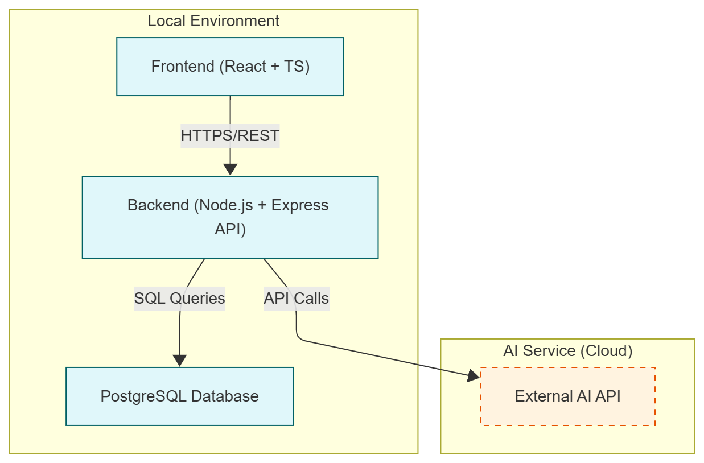

# 2. Technical Implementation

This section covers the technical architecture, design decisions, and implementation details.

## Contents

- [Tech Stack](tech-stack.md)
- [Refined Ux Documentation](criteria/refined-ux.md)
- [Adaptive Ui Documentation](criteria/adaptive-ui.md)
- [Ai Assistant Documentation](criteria/ai-assistant.md)
- [Containerization Documentation](criteria/containerization.md)
- [Database Documentation](criteria/database.md)
- [Frontend Documentation](criteria/frontend.md)
- [Qualitative Testing Documentation](criteria/qualitative-testing.md)
- [Deployment](deployment.md)

## Solution Architecture

### High-Level Architecture


### System Components

| Component | Description | Technology |
|-----------|-------------|------------|
| **Frontend** | Single-page application providing responsive user interface for journaling, analytics, and AI interactions | React 18 + TypeScript, SCSS, Ant Design |
| **Backend** | RESTful API server handling authentication, business logic, database operations, and AI integration | Node.js 20 + Express.js, TypeScript |
| **Database** | Relational database storing user accounts, journal entries, emotions, AI reports, insights, and analytics | PostgreSQL 16 |
| **AI Service** | External API for natural language processing, emotion detection, and report generation | Google Gemini |

### Data Flow

```
┌─────────────┐
│ User Action │ (e.g., Create journal entry)
└──────┬──────┘
       │
       ▼
┌─────────────────┐
│    Frontend     │ Validates input, prepares request
│   (React SPA)   │
└──────┬──────────┘
       │ HTTP POST /api/diary/entry
       │ Headers: Authorization: Bearer <JWT>
       │ Body: { entryDate, content, emotions }
       ▼
┌─────────────────┐
│  Backend API    │ 1. Verify JWT token
│ (Express.js)    │ 2. Validate request data
└──────┬──────────┘ 3. Execute business logic
       │
       ▼
┌─────────────────┐
│ Business Logic  │ Process entry data, prepare for storage
└──────┬──────────┘
       │
       ▼
┌─────────────────┐
│   Data Layer    │ Build SQL query, map objects
└──────┬──────────┘
       │
       ▼
┌─────────────────┐
│   PostgreSQL    │ INSERT entry, UPDATE user stats
│    Database     │ COMMIT transaction
└──────┬──────────┘
       │
       │ (Optional: Trigger AI analysis)
       │
       ▼
┌─────────────────┐
│  External AI    │ Analyze entry text
│      API        │ Return detected emotions
└──────┬──────────┘
       │
       ▼
┌─────────────────┐
│    Response     │ Format response: { success, entry, aiAnalysis }
└──────┬──────────┘
       │ HTTP 200 OK
       │ JSON response
       ▼
┌─────────────────┐
│    Frontend     │ Update UI, show success message
│   (React SPA)   │ Refresh entry list
└─────────────────┘
```

## Key Technical Decisions

| Decision | Rationale | Alternatives Considered |
|----------|-----------|------------------------|
| **React + TypeScript** | Type safety reduces bugs, React ecosystem mature with extensive libraries, TypeScript improves maintainability for solo developer | Vue.js (less familiar), Angular (too heavy for MVP), vanilla JavaScript (lacks type safety) |
| **Node.js + Express** | JavaScript across full stack reduces context switching, large ecosystem, excellent async I/O for API calls, familiar to developer | Python + FastAPI (requires learning new language), NestJS (more structured but steeper learning curve) |
| **PostgreSQL** | Strong support for relational data and complex analytics queries needed for emotion tracking, ACID compliance ensures data integrity, free tier available on Railway | MongoDB (less suitable for analytical queries) |
| **Railway for Backend + DB** | Simple deployment with integrated PostgreSQL, affordable free tier, automatic HTTPS, minimal DevOps overhead for solo developer | AWS/Azure (complex setup) |
| **Vercel for Frontend** | Optimized for React/Next.js deployments, excellent CDN performance, automatic deployments from Git, generous free tier | Netlify (similar but less React-focused) |
| **JWT Authentication** | Stateless authentication scales well, no server-side session storage needed, works seamlessly with SPA architecture | Session-based auth (requires sticky sessions), OAuth (unnecessary complexity for MVP), Firebase Auth (vendor lock-in) |
| **Docker for Local Dev** | Consistent development environment, easy PostgreSQL setup, matches production deployment model on Railway | Local PostgreSQL installation (inconsistent across machines), cloud-only development (slower iteration) |

## Security Overview

| Aspect | Implementation |
|--------|----------------|
| **Authentication** | JWT (JSON Web Tokens), tokens expire after 7 days, bcrypt password hashing with salt rounds = 10 |
| **Authorization** | Middleware validates JWT on protected routes, user ID extracted from token payload, all database queries filtered by authenticated user ID to ensure data isolation |
| **Data Protection** | HTTPS enforced on all environments (Railway + Vercel), passwords hashed with bcrypt before storage, JWT secrets stored in environment variables, AI API requests send anonymized data (no user IDs) |
| **Secrets Management** | Environment variables stored in Railway/Vercel dashboards, no secrets committed to Git (.env files in .gitignore) |
| **CORS** | CORS configured to allow only frontend domain (Vercel URL) |
| **Rate Limiting** | AI API calls limited per user per day |
| **Data Privacy** | Account deletion permanently removes all associated data, GDPR-compliant data handling principles applied |
