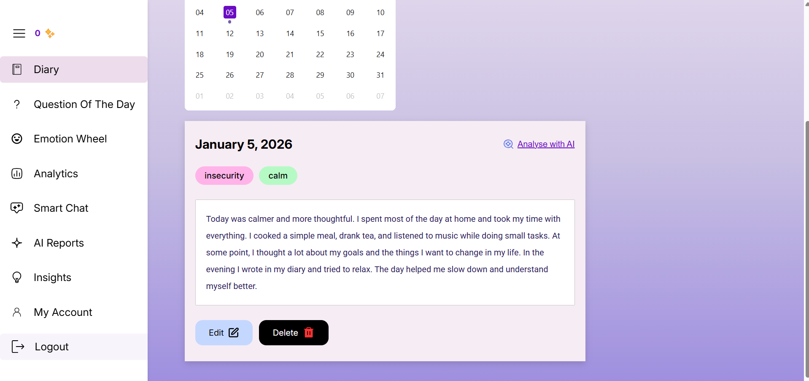
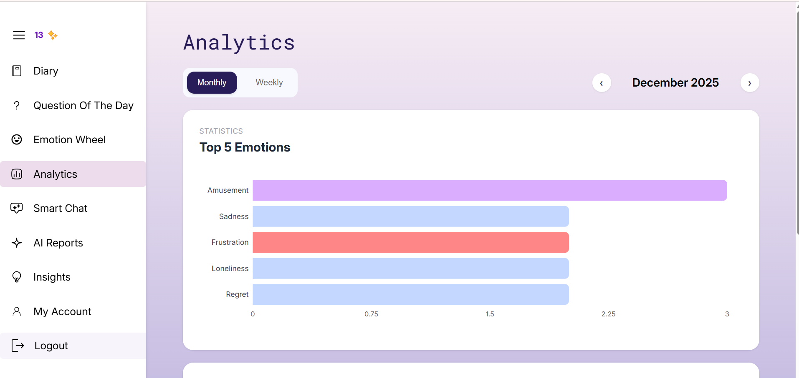
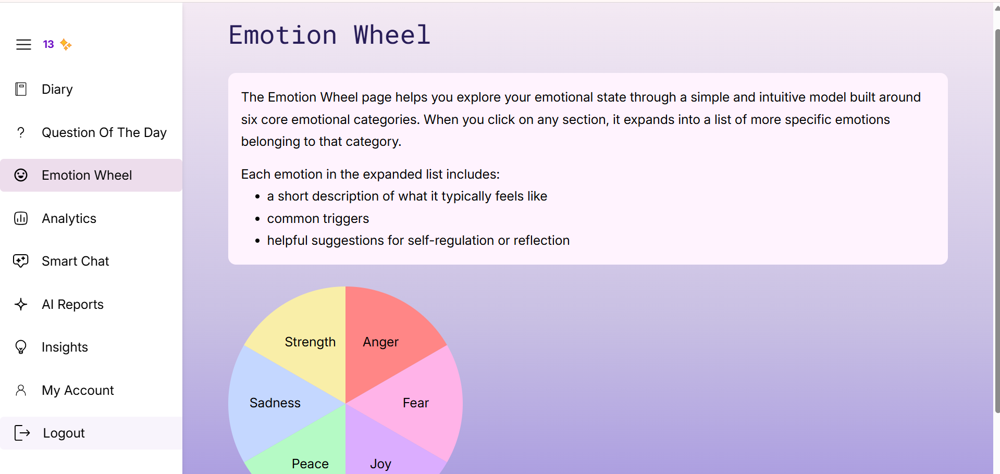
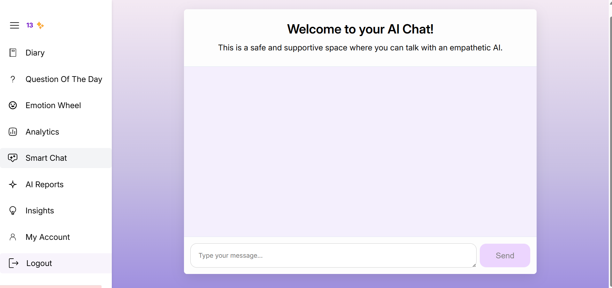
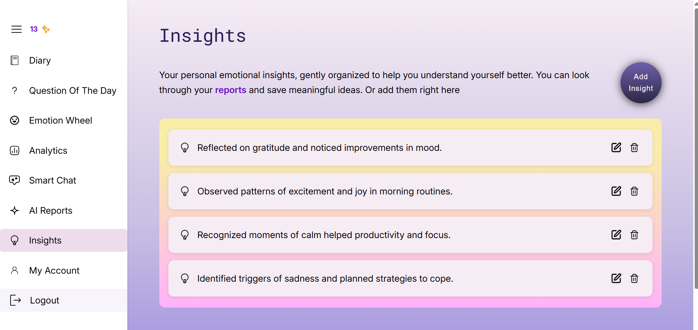
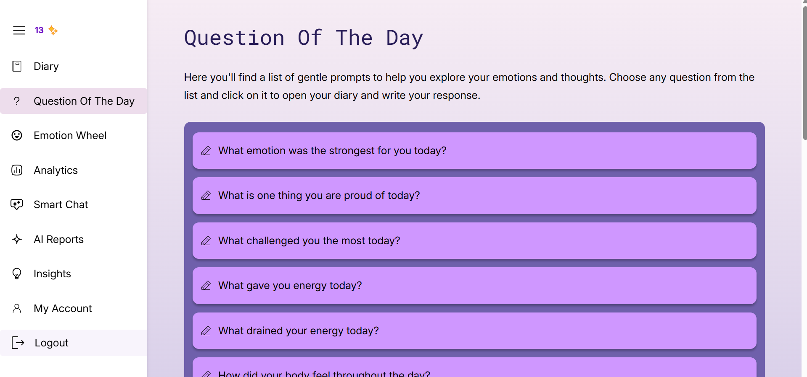
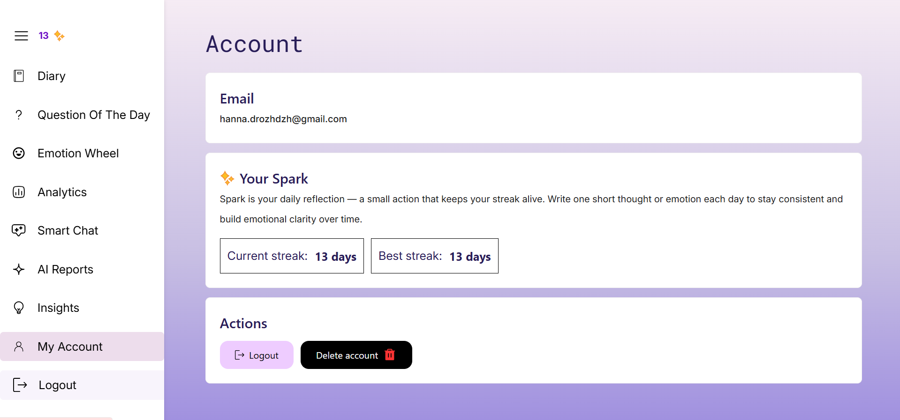

# Feature Walkthrough

This section provides a detailed walkthrough of the main features of the Emotion Diary application, explaining their purpose and how users can interact with them.

## Feature 1: Daily Journal Entry

### Overview

The Daily Journal allows users to write personal reflections and tag their emotions. This feature is the core of the application and serves as the primary data source for emotional analysis and statistics.

### How to Use

**Step 1:** Open the **Diary** page after logging in

- The current date is selected by default

**Step 2:** Write your thoughts and experiences in the text input field

- Length limit is min 3 characters, max 10000 characters; more detailed entries improve analysis quality

**Step 3:** Select one or more emotions that best describe how you feel

- Emotions are based on a psychological emotion wheel

**Step 4:** Click **Save**

**Expected Result:**  
The entry is saved successfully and appears in the diary list for the selected date.

### Tips

- Write honestly and descriptively for better emotional insights
- Selecting multiple emotions helps capture emotional nuance

## Feature 2: Daily AI Emotion Analysis

### Overview

AI Emotion Analysis processes journal text to detect underlying emotions, patterns, and possible triggers. It provides personalized feedback to help users better understand their emotional state.

### How to Use

**Step 1:** Open an existing journal entry

**Step 2:** Click the **Analyze with AI** button

**Step 3:** Wait for the analysis to complete

**Expected Result:**  
An AI-generated report is displayed, including:

- Detected emotions
  - Comparison to the emotions you selected
  - Emotional triggers
  - Emotional insights
  - Recommendations

The report is saved and can be revisited later.

### Tips

- Longer and more detailed entries produce more meaningful AI feedback
- AI analysis can be repeated after editing an entry

## Feature 3: Analytics Dashboard

### Overview

The Analytics Dashboard visualizes emotional data collected from journal entries. It helps users identify trends and dominant emotions over time.

### How to Use

**Step 1:** Navigate to the **Analytics** section

**Step 2:** Select a time range:

- Week
- Month

**Step 3:** Review the displayed statistics

**Expected Result:**  
The dashboard shows:

- Emotion distribution chart
- Top 5 most frequent emotions for the selected period

Charts update automatically when the time range changes.

### Tips

- Weekly view is useful for short-term mood tracking
- Monthly view helps identify long-term emotional patterns

## Feature 4: Emotion Wheel (Educational)

### Overview

The Emotion Wheel is an educational tool that helps users understand and differentiate emotions. It supports emotional literacy and improves emotion selection accuracy during journaling.

### How to Use

**Step 1:** Open the **Emotion Wheel** page

**Step 2:** Click on a primary emotion category

**Step 3:** Explore related sub-emotions and descriptions

**Expected Result:**  
Detailed explanations of emotions are displayed, helping users better label their feelings.

### Tips

- Use this feature when you are unsure how to describe your emotions
- Learning emotion vocabulary improves self-reflection quality

## Feature 5: Smart Chat (AI Emotional Support)

### Overview

Smart Chat is an AI-powered conversational feature that allows users to express their thoughts and emotions in a dialogue format. It provides empathetic responses, emotional validation, and gentle guidance, helping users reflect on their feelings in real time.

### How to Use

**Step 1:** Navigate to the **Smart Chat** section after logging in  

**Step 2:** Type a message describing your current thoughts or emotional state  

- Messages can be short or detailed; minimum 3 characters, maximum 5000 characters

**Step 3:** Send the message to the AI assistant  

**Expected Result:**  
The AI responds with:
- Empathetic feedback
- Emotional reflection
- Supportive suggestions or questions for further self-reflection

The conversation remains private and is not shared with other users.

### Tips

- Use Smart Chat when you need help with identifying your emotions or seek advice
- Honest and open messages lead to more meaningful responses
- Smart Chat complements journaling but does not replace professional help

## Feature 6: Insights Collection

### Overview

The Insights Collection allows users to save meaningful AI-generated observations for long-term reflection. It acts as a personal knowledge base of emotional discoveries.

### How to Use

**Step 1:** Open an AI-generated report or Insights page

**Step 2:** Click **Add Insight** 

**Step 3:** Write or copy paste text in the form

**Step 4:** Click **Save**

**Step 4:** Navigate to **Insights** to view saved items  

**Expected Result:**  
The selected insight is saved and displayed in the personal insights list.

### Tips

- Save insights that reveal recurring patterns or important realizations
- Periodically review saved insights to track personal growth

## Feature 7: Question of the Day

### Overview

The Question of the Day feature provides reflective prompts to help users start journaling, especially when they are unsure what to write about.

### How to Use

**Step 1:** Navigate to the **Questions** section  

**Step 2:** Browse the list of reflective questions  

**Step 3:** Select a question  

**Expected Result:**  
The selected question is automatically inserted into the journal editor as a writing prompt.

### Tips

- Use questions as a starting point, not a restriction
- Answering different questions over time increases reflection depth

## Feature 8: "Spark" Streak Gamification

### Overview

The Spark feature tracks daily journaling consistency and visualizes it as a streak indicator. Its goal is to encourage habit formation without introducing social comparison.

### How to Use

**Step 1:** Create at least one journal entry per day  

**Step 2:** View your current streak on the dashboard in Account

**Expected Result:**  
- The streak increases with consecutive daily entries  
- The streak resets if no entry is created within 24 hours  
- Current and longest streak values are displayed  

### Tips

- Focus on consistency rather than entry length
- Even short daily entries help maintain the streak

## Feature Availability

| Feature                 | Availability |
|-------------------------|--------------|
| Daily Journal           | ✅ Available |
| AI Emotion Analysis     | ✅ Available |
| Analytics Dashboard     | ✅ Available |
| Emotion Wheel           | ✅ Available |
| Weekly AI Reports       | ⚠️ Partially Available |
| Insights Collection     | ✅ Available |
| Question of the Day     | ✅ Available |
| Spark Streak            | ⚠️ Partially Available |

