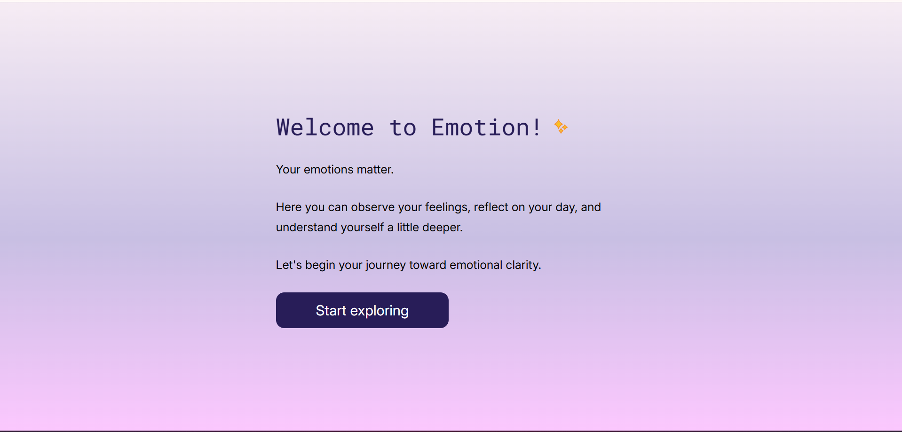
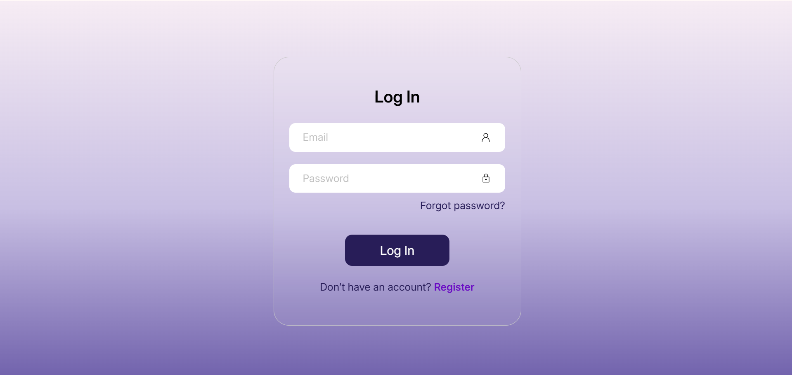
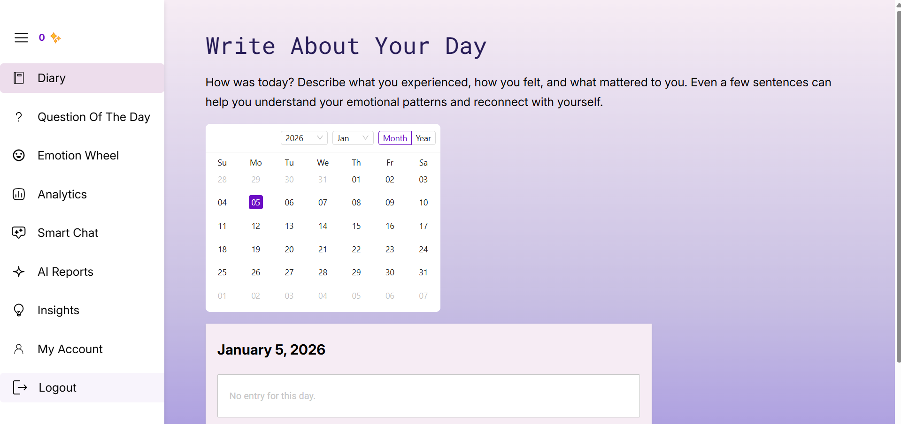
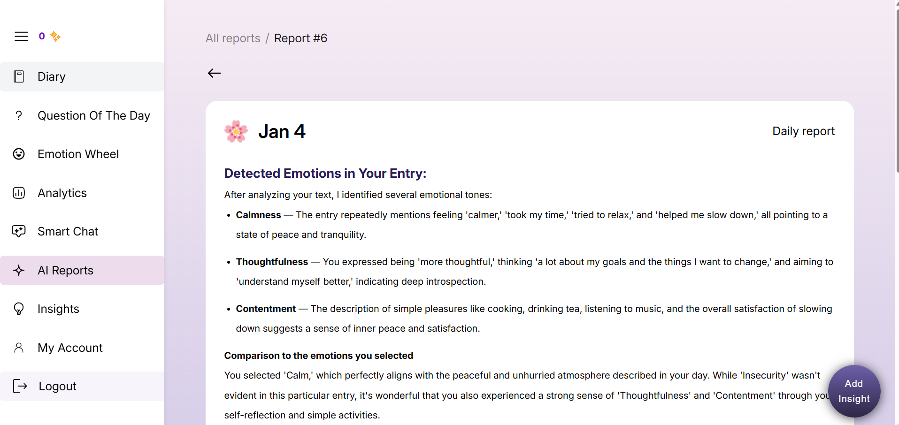

# 3. User Guide

This section provides instructions for end users on how to use the application.

## Contents

- [Features Walkthrough](features.md)
- [FAQ & Troubleshooting](faq.md)

## Getting Started

### System Requirements

| Requirement | Minimum | Recommended |
|------------|---------|-------------|
| **Browser** | Chrome 90+, Firefox 88+, Safari 14+, Edge 90+ | Latest version |
| **Screen Resolution** | Mobile: 350px | 1280×720 |
| **Internet** | Required | Stable broadband connection |
| **Device** | Mobile / Tablet / Desktop | Desktop or Tablet |

### Accessing the Application

1. Open your web browser
2. Navigate to: **https://emotion-amber.vercel.app**
3. You will be redirected to the login page if not authenticated

## First Launch

### Welcome Screen

On first launch, users see a welcome screen briefly explaining the purpose of the application

Click **Start exploring** to continue.

### Step 1: Registration / Login

1. Click **Register** to create a new account
2. Enter email and password (minimum 8 characters, a capital letter and a number)
3. Click **Create Account**
4. Existing users can log in using **Log In**

If the password is forgotten, use **Forgot Password** to reset it via email.

### Step 2: First Journal Entry

After successful login, the user is redirected directly to the **Diary page**.

1. Write your first journal entry in the text area
2. Select one or more emotions that match your current state
3. Click **Save**

This first entry initializes emotion tracking and statistics.

### Step 3: AI Analysis

After saving an entry:

1. Click **Analyze with AI** inside the diary entry
2. The system sends the text to the AI service
3. An AI-generated report is displayed, including:
   - Detected emotions
   - Comparison to the emotions you selected
   - Emotional triggers
   - Emotional insights
   - Recommendations

Reports are saved and can be revisited later.

## Quick Start Guide

| Task | How To |
|-----|--------|
| Create first entry | Diary → Write text → Select emotions → Save |
| Analyze emotions | Open entry → Analyze with AI |
| View weekly/monthly stats | Analytics → Select Week or Month |
| Learn emotions | Emotion Wheel → Choose emotion |
| Keep streak | Write at least one entry per day |

## User Roles

| Role | Permissions | Access Level |
|-----|-------------|--------------|
| **User** | Full access to journaling, analytics, AI reports, insights | Full |
| **Superuser (Developer)** | System configuration, debugging, monitoring | Internal |
